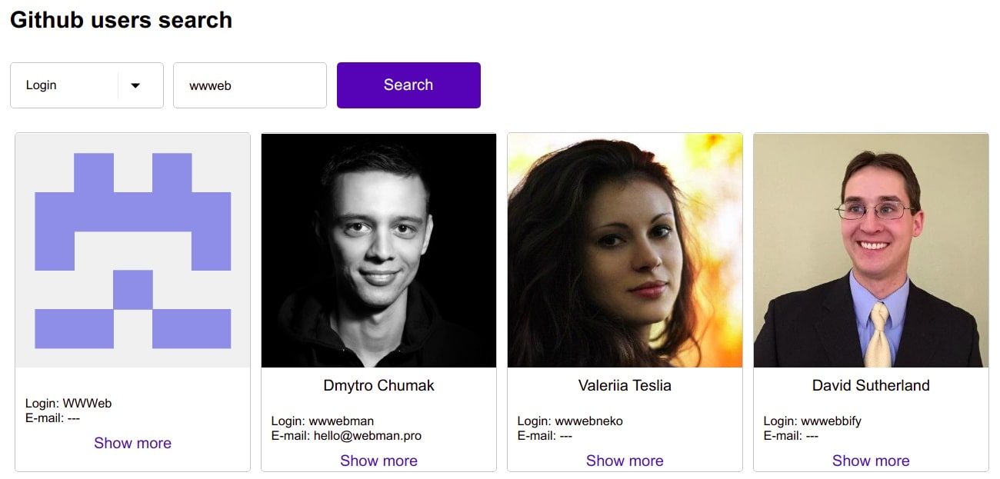

## Task

Develop a simple **React application** that allows **searching Github users** by login, name, or email.

### Clone this repository

- `git clone https://github.com/0xYao/fullstack-challenge.git`

### Setup the server

- `cd server`
- `cp .env.sample .env`
  - Create a personal access token (classic) [here](https://github.com/settings/tokens)
  - Select these two permissions only
  
- `npm install`
- `npm start`

### Setup the frontend App

Note: the NodeJS version needs to be at least v16

- `cd client`
- `cp .env.sample .env.local`
- `npm install`
- `npm run dev`

### Components

Implement the following components:

- `<Select placeholderText="Search by" />`
- `<Input placeholderText={selectedOption} />`
- `<SubmitButton />`
- `<UsersList />`
- `<UserProfileCard />`

You can create your own components or use component libraries such as material-ui, chakra UI etc

### User path

1. A user chooses "Search by" option using `<Select />` component ("Login", "Name", "Email"):
1. A user provides a value to the `<Input />` component, and the following validation occurs:
   - "Search by" :point_right: "Name":
     - Required
     - Minimum 3 characters
   - "Search by" :point_right: "Login":
     - Required
     - Minimum 3 characters
   - "Search by" :point_right: "Email":
     - Required
     - Accepts only valid email format
1. A user clicks `<SubmitButton />`
1. A user gets `<UserProfileCard />` with profile information or _"No users found."_ message.

### Required

1. Use React.js
1. Use any other libraries that can help you to implement the task

### Important!

- You can use any other API instead of [Github](#github-api) if you think you can be more performant with it
- Use any technology stack around your React application
  - State management:
    - [Apollo](https://www.apollographql.com/docs/react/)
    - [React context](https://reactjs.org/docs/context.html)
    - [Redux](https://redux.js.org/)
    - [React Query](https://tanstack.com/query/v4/docs/react/quick-start)
  - Styling:
    - Vanilla CSS
    - [Sass](https://sass-lang.com/)
    - [Styled-components](https://styled-components.com/)
    - [Tailwind](https://tailwindcss.com/)

### Design example

The following design is the only example that would give you a visual understanding of what is required by the task.
It would be great if can make it look even better than in the following example:



</details>

### Github API

- Implement the API-related logic in the `server` folder

#### GitHub GraphQL API

Here are some details if you decide to use Github Graphql API:

- [Documentation](https://developer.github.com/v4/)
- [Explorer](https://developer.github.com/v4/explorer/)
- See the example of a query in `server/services/github.service.ts`

**Queries:**

```
query SearchUsers($query: String!, $first: Int!) {
  search(query: $query, type: USER, first: $first) {
    edges {
      node {
        ... on User {
          login
        }
      }
    }
  }
}

query GetUser($login: String!) {
  user(login: $login) {
    name
    bio
    websiteUrl
  }
}
```

**Variables:**

```json
{
  "query": "Dan Abramov",
  "first": 10,
  "login": "gaearon"
}
```

#### GitHub REST API

The [documentation](https://docs.github.com/en/free-pro-team@latest/rest/reference/users).
